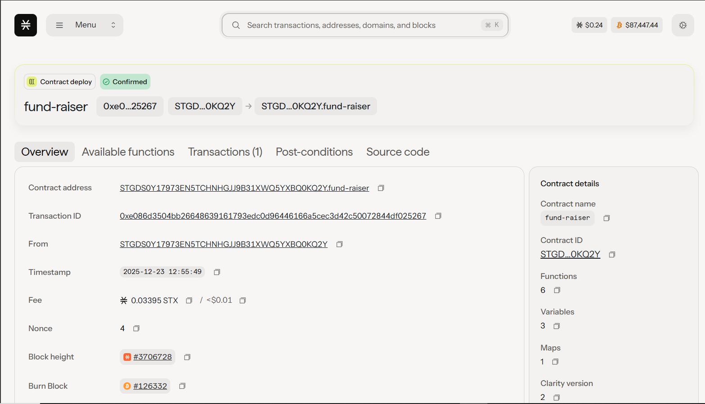
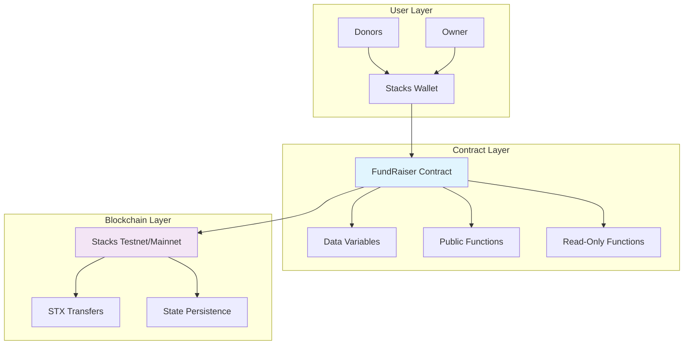
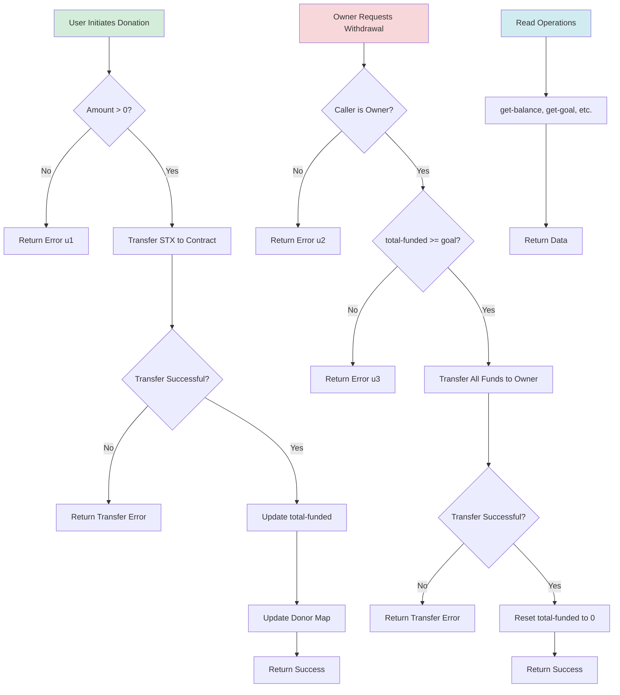

# FundRaiser Smart Contract

[](https://github.com/hirosystems/clarinet)
[](https://clarity-lang.org/)
[](https://stacks.co/)
[](LICENSE)

A secure, decentralized FundRaiser smart contract built on the Stacks blockchain using Clarity 4. This contract enables users to donate STX towards a predefined funding goal, with the owner able to withdraw funds once the goal is reached. Designed with security best practices, including reentrancy protection and overflow safeguards.



## Table of Contents

- [Overview](#overview)
- [Features](#features)
- [Architecture](#architecture)
- [System Flow](#system-flow)
- [Prerequisites](#prerequisites)
- [Installation](#installation)
- [Usage](#usage)
- [API Reference](#api-reference)
- [Testing](#testing)
- [Deployment](#deployment)
- [Security](#security)
- [Contributing](#contributing)
- [License](#license)
- [Support](#support)

## Overview

The FundRaiser contract is a decentralized crowdfunding solution on the Stacks blockchain. It allows anyone to contribute STX (Stacks cryptocurrency) towards a fixed funding goal. Once the goal is met, the contract owner can withdraw the entire balance. The contract tracks individual donor contributions and ensures secure, transparent fund management.

**Contract Address (Testnet)**: `STGDS0Y17973EN5TCHNHGJJ9B31XWQ5YXBQ0KQ2Y.fund-raiser`

## Features

- **Decentralized Funding**: Accept STX donations from any user on the Stacks network
- **Goal-Based Withdrawal**: Funds can only be withdrawn by the owner after reaching the predefined goal
- **Donor Tracking**: Maintains a record of each donor's total contribution
- **Security-First Design**: Implements assertions, error handling, and overflow protection
- **Clarity 4 Compatibility**: Leverages modern Clarity features for robust smart contract development
- **Testnet Deployed**: Live on Stacks testnet for testing and demonstration

## Architecture

The FundRaiser contract follows a modular architecture designed for security and efficiency on the Stacks blockchain.



### Components

- **Data Variables**: Store contract state (owner, goal, total-funded, donor map)
- **Public Functions**: Handle state-changing operations (fund, withdraw)
- **Read-Only Functions**: Provide data access without modifying state
- **Error Handling**: Uses Clarity's `try!` and `asserts!` for robust error management

## System Flow

The following diagram illustrates the complete flow of the FundRaiser system, from donation to withdrawal.



### Key Flows

1. **Donation Flow**: Validates amount, transfers STX, updates state
2. **Withdrawal Flow**: Verifies ownership and goal achievement, transfers funds
3. **Query Flow**: Provides read-only access to contract data

## Prerequisites

- [Node.js](https://nodejs.org/) (v16 or higher)
- [Clarinet](https://github.com/hirosystems/clarinet) (v2.9.0 or higher)
- [Stacks CLI](https://docs.stacks.co/docs/stacks-cli/) (optional, for advanced interactions)
- A Stacks wallet with testnet STX for deployment and testing

## Installation

1. **Clone the repository**:
   ```bash
   git clone <repository-url>
   cd clarity-contract
   ```

2. **Install dependencies**:
   ```bash
   npm install
   ```

3. **Verify Clarinet installation**:
   ```bash
   clarinet --version
   ```

4. **Check contract compilation**:
   ```bash
   clarinet check
   ```

## Usage

### Interacting with the Contract

#### Using Stacks CLI

1. **Fund the contract**:
   ```bash
   stx contract call STGDS0Y17973EN5TCHNHGJJ9B31XWQ5YXBQ0KQ2Y.fund-raiser fund 500000 --network testnet --fee 1000
   ```

2. **Check balance**:
   ```bash
   stx contract call STGDS0Y17973EN5TCHNHGJJ9B31XWQ5YXBQ0KQ2Y.fund-raiser get-balance --network testnet
   ```

3. **Withdraw funds (owner only)**:
   ```bash
   stx contract call STGDS0Y17973EN5TCHNHGJJ9B31XWQ5YXBQ0KQ2Y.fund-raiser withdraw --network testnet --fee 1000
   ```

#### Using JavaScript/TypeScript

```typescript
import { callReadOnlyFn, makeContractCall } from '@stacks/transactions';

// Get current balance
const balance = await callReadOnlyFn({
  contractAddress: 'STGDS0Y17973EN5TCHNHGJJ9B31XWQ5YXBQ0KQ2Y',
  contractName: 'fund-raiser',
  functionName: 'get-balance',
  functionArgs: [],
  network: 'testnet'
});

// Fund the contract
const fundTx = await makeContractCall({
  contractAddress: 'STGDS0Y17973EN5TCHNHGJJ9B31XWQ5YXBQ0KQ2Y',
  contractName: 'fund-raiser',
  functionName: 'fund',
  functionArgs: [uintCV(1000000)], // 1 STX
  network: 'testnet'
});
```

### Example Workflow

1. Deployer sets goal to 1,000,000 microSTX (1 STX)
2. Users donate STX via the `fund` function
3. Contract tracks total funded and individual contributions
4. Once total-funded >= goal, owner can call `withdraw`
5. All funds are transferred to owner, contract resets

## API Reference

### Public Functions

#### `fund(amount: uint) -> (response bool uint)`

Allows users to donate STX to the fundraiser.

**Parameters:**
- `amount`: Amount of microSTX to donate (must be > 0)

**Returns:**
- `(ok true)` on success
- `(err u1)` if amount is 0 or invalid

**Events:** Updates `total-funded` and donor map

#### `withdraw() -> (response bool uint)`

Allows the contract owner to withdraw all funds once the goal is reached.

**Parameters:** None

**Returns:**
- `(ok true)` on success
- `(err u2)` if caller is not owner
- `(err u3)` if goal not reached

**Events:** Resets `total-funded` to 0

### Read-Only Functions

#### `get-balance() -> uint`

Returns the current total funded amount.

#### `get-goal() -> uint`

Returns the funding goal.

#### `get-donor-amount(donor: principal) -> uint`

Returns the total amount donated by a specific donor.

**Parameters:**
- `donor`: The principal address of the donor

#### `get-owner() -> principal`

Returns the contract owner's principal address.

## Testing

Run the comprehensive test suite using Vitest:

```bash
npm test
```

For test coverage report:

```bash
npm run test:report
```

### Test Coverage

- ✅ Valid donations and balance updates
- ✅ Rejection of zero-amount donations
- ✅ Multiple donor tracking
- ✅ Owner-only withdrawal restrictions
- ✅ Goal-based withdrawal logic
- ✅ Read-only function accuracy

## Deployment

### Testnet Deployment

The contract is already deployed on testnet. To redeploy or deploy to mainnet:

1. **Configure network settings** in `settings/Testnet.toml` or `settings/Mainnet.toml`

2. **Generate deployment plan**:
   ```bash
   clarinet deployments generate --testnet --medium-cost
   ```

3. **Apply deployment**:
   ```bash
   clarinet deployments apply --testnet
   ```

### Mainnet Deployment

For production deployment:

1. Update `settings/Mainnet.toml` with mainnet configuration
2. Ensure sufficient STX balance for deployment fees
3. Follow the same generate/apply process with `--mainnet` flag

## Security

This contract implements multiple security measures:

- **Access Control**: Only owner can withdraw funds
- **Input Validation**: Amount checks prevent invalid donations
- **State Consistency**: Atomic operations prevent partial updates
- **Overflow Protection**: Clarity's built-in overflow handling
- **Reentrancy Prevention**: Single-threaded execution model
- **Error Handling**: Comprehensive error codes and messages

### Audit Recommendations

- Conduct third-party security audit before mainnet deployment
- Monitor contract interactions post-deployment
- Implement upgrade mechanisms for future improvements

## Contributing

We welcome contributions to improve the FundRaiser contract!

1. Fork the repository
2. Create a feature branch: `git checkout -b feature/amazing-feature`
3. Commit changes: `git commit -m 'Add amazing feature'`
4. Push to branch: `git push origin feature/amazing-feature`
5. Open a Pull Request

### Development Guidelines

- Follow Clarity best practices
- Add comprehensive tests for new features
- Update documentation for API changes
- Ensure all tests pass before submitting PR

## License

This project is licensed under the MIT License - see the [LICENSE](LICENSE) file for details.

## Support

- **Documentation**: [Clarity Language Reference](https://clarity-lang.org/)
- **Stacks Docs**: [Developer Documentation](https://docs.stacks.co/)
- **Community**: [Stacks Discord](https://discord.gg/stacks)
- **Issues**: [GitHub Issues](https://github.com/your-repo/issues)

For questions or support, please open an issue on GitHub or reach out to the development team.

---

**Built with ❤️ on the Stacks blockchain**